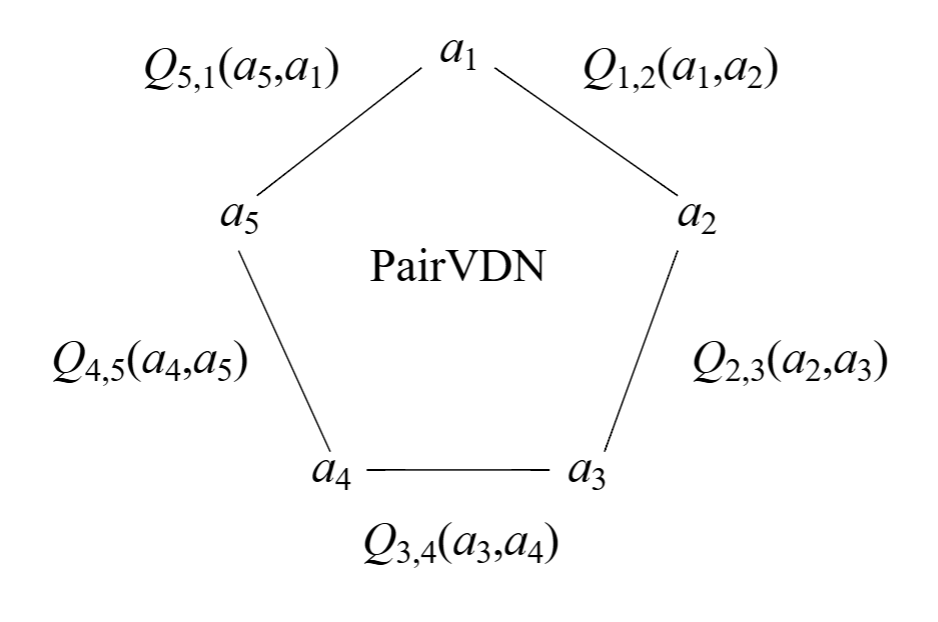
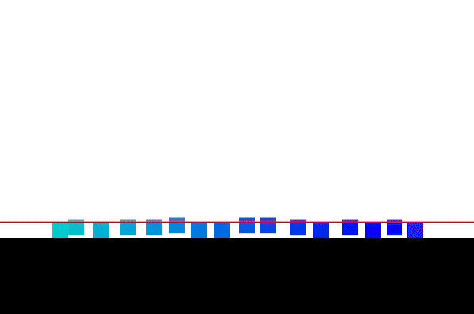

# PairVDN - Pair-wise Decomposed Value Functions

<p align="center"">
    
</p>

This is the codebase for PairVDN, and is minimally implemented from scratch in jax (with equinox).
It also contains the implementation of our custom environment Box Jump (`box_env.py`).


## Setup
```
pip install swig
pip install -r requirements.txt
```
The codebase uses `wandb`, which you may disable with the environment variable `WANDB_MODE=offline`.


## Usage
<p align="center"">
    
</p>

First, create a model folder and `config.json` in the `models` directory. Examples - and pre-trained models -  for the Box Jump environment
with 8 agents can be found under `models/box_8/[model_type]`. Then, to train, run multiagent_train.py,
specifying the config path with `-r`, for example
```
python multiagent_train.py -r box_8/pvdn
```
or, to evaluate (and visualise agent behaviour),
```
python evaluate.py -r box_8/pvdn -n 1 --max_timestep 1000
```
where `-n` indicates the number of episodes to ues for evaluation. Following calculation,
episodes are repeatedly visualised using PyGame. As this particular model is provided in the repo, this exact command should work already.

To view the box jump environment with random agent behaviour, just run
```
python box_env.py
```

### Models
I use the following layout for models:
```
models/
 env_name/
  model_name/
   config.json    # model and training config
   model.eqx      # saved model
   stats.pickle   # stores loss, reward, and Q values during training
```
where each `config.json` contains information corresponding to the `Config` object in `config.py`,
and replaces  command line arguments. As the models are pretty small, I've included a bunch in the repo, 
so you should be able to run evaluation and view behaviour as well as reward etc stats.
